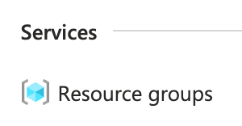
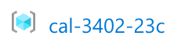
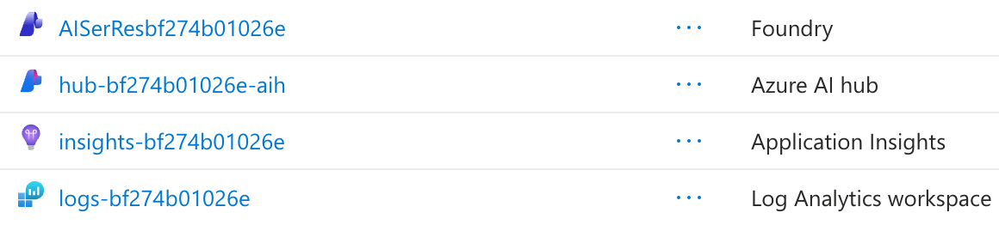
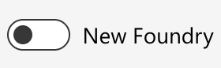
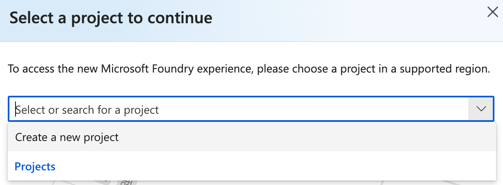

### Introduction

- Review the Azure Resource Group created for this lab.
- Familiarize yourself with the resources that will be used in subsequent steps.

### Instructions

1. In the Azure portal, enter *resource groups* in the search bar and select *Resource groups* from the results:

    

1. Click the resource group created for this lab, *cal-####-###*:

    

    This lab will touch on several resources within this resource group, including the Microsoft Foundry Agent Service, Application Insights, and Log Analytics workspace:

    

    - Microsoft Foundry Agent Service (Foundry): This service allows you to create and manage AI agents that can interact with users and other services. The Foundry portal provides tools for building, deploying, and monitoring these agents.
    - Log Analytics Workspace: The centralized repository for collecting and analyzing log data from various sources, including your AI agents. It enables you to perform advanced queries and create visualizations to gain insights into your agents' behavior.
    - Application Insights: The application performance management service that provides insights into the performance and usage of your AI agents. Application Insights stores its telemetry in a connected Log Analytics workspace, letting you query, correlate, and visualize AI agent performance data with Kusto-based analytics.

1. Click the **AISerRes###** Foundry resource:

    

1. Click **Go to Foundry portal** to open the Microsoft Foundry portal in a new tab:

    

1. Click the **New Foundry** toggle button to switch the new Foundry portal experience:

    

    You will be prompted to select or create a project.

1. Select **Create a new project** from the dropdown menu:

    

    

### Summary

In this lab step, ...
