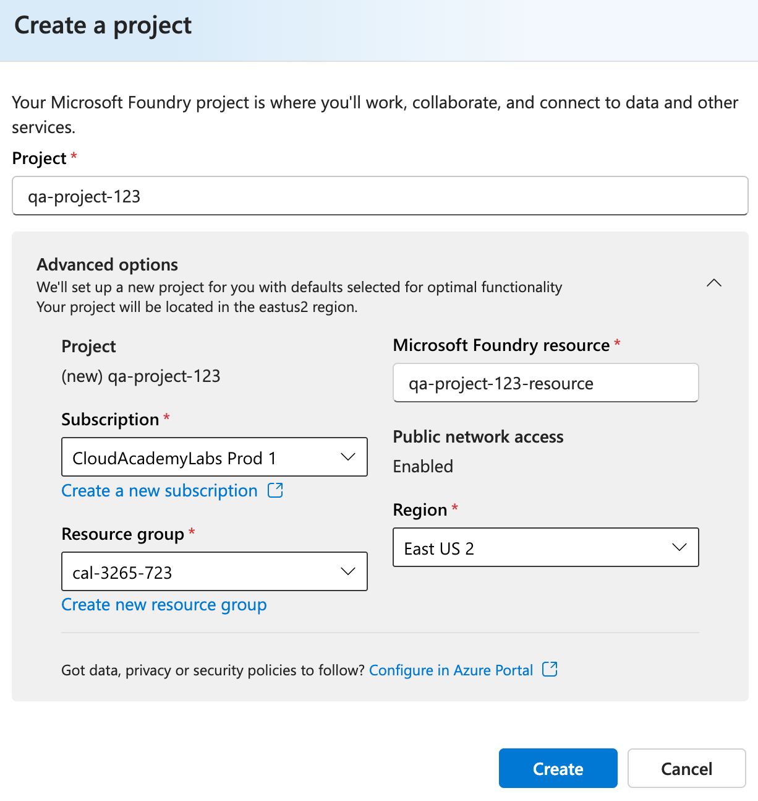
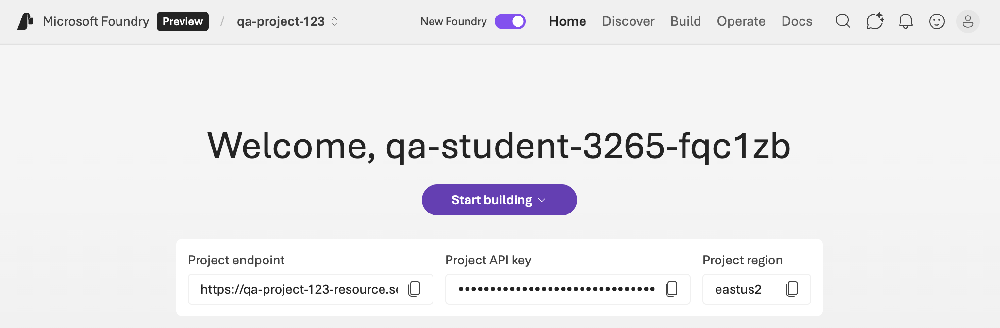

### Introduction

In this lab step, you will explore the Azure Resource Group that was created as part of the lab environment setup. This resource group contains supporting resources the necessary resources for building, deploying, and monitoring AI agents using Microsoft Foundry Agent Service, Application Insights, and Log Analytics.

You will also create a new project in the Foundry portal, which will serve as the foundation for building your AI agent in subsequent steps.

### Instructions

1. In the Azure portal, enter *resource groups* in the search bar and select **Resource groups** from the results:

    {: style="width:150px"}

1. Click the resource group created for this lab, **cal-####-###**:

    {: style="width:111px"}

    This lab will touch on the resources within this resource group, including Application Insights, and Log Analytics workspace:

    

    - Log Analytics Workspace: The centralized repository for collecting and analyzing log data from various sources, including your AI agents. It enables you to perform advanced queries and create visualizations to gain insights into your agents' behavior.
    - Application Insights: The application performance management service that provides insights into the performance and usage of your AI agents. Application Insights stores its telemetry in a connected Log Analytics workspace, letting you query, correlate, and visualize AI agent performance data with Kusto-based analytics.

    One last resource to note is the Foundry project itself, which you will create next. Within Foundry you will focus on the Agent Service:

    - Microsoft Foundry Agent Service (Foundry): This service allows you to create and manage AI agents that can interact with users and other services. The Foundry portal provides tools for building, deploying, and monitoring these agents.

1. Navigate to the [Microsoft Foundry portal](https://ai.azure.com).

    Ensure that your lab student user {Student.provider_user_name} is the active profile in the upper-right corner of the Foundry portal (if not, click **Sign in with a different account** and choose your lab user).

1. Click the **New Foundry** toggle button to switch the new Foundry portal experience:

    {: style="width:140px"}

    You will be prompted to select or create a project.

1. Select **Create a new project** from the dropdown menu:

    {: style="width:616px"}

1. In the **Create a project** pane, enter *qa-project-###* below **Project**, replacing *###* with a unique number.

1. Select the **cal-####** resource group from the **Resource group** dropdown menu, then click **Create**:

    {: style="width:613px"}

    Leave all other settings at their defaults. The project setup will take up to 2 minutes to complete.

    Once completed, the Foundry portal will display the project dashboard:

    {: style="width:1030px"}

### Summary

In this lab step, you reviewed the Azure Resource Group created for the lab environment and created a new project in the Microsoft Foundry portal.
