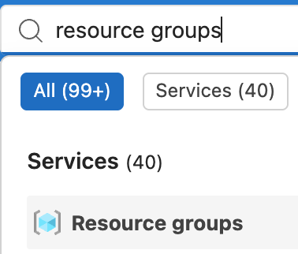
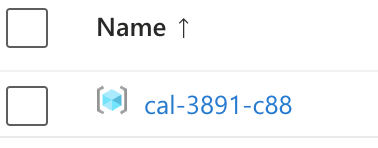
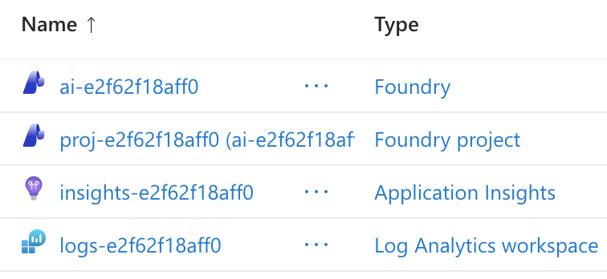
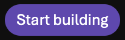
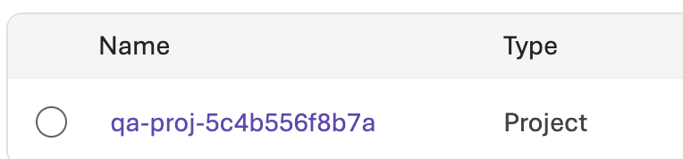
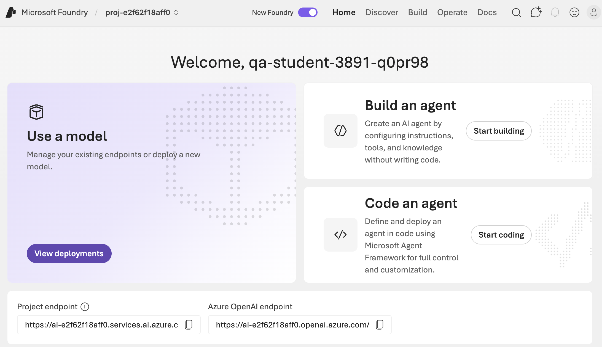

### Introduction

In this lab step, you will explore the Azure Resource Group that was created as part of the lab environment setup. This resource group contains supporting resources the necessary resources for building, deploying, and monitoring AI agents using Microsoft Foundry Agent Service, Application Insights, and Log Analytics.

### Instructions

1. In the Azure portal, enter *resource groups* in the search bar and select **Resource groups** from the results:

    {: style="width:189px"}

1. Click the resource group created for this lab, **cal-####-###**:

    {: style="width:189px"}

    This lab will touch on the resources within this resource group, including Application Insights, Log Analytics workspace and MS Foundry resources:

    {: style="width:378px"}

    - Foundry: The unified Microsoft Foundry resource that provides the core AI platform capabilities for building and operating AI agents, models, and tools. It hosts shared settings such as deployments, networking, security, and connected tools.
    - Foundry project: A project-scoped workspace within a Foundry resource used to organize AI development assets such as agents, model deployments, evaluations, traces, datasets, indexes, and connections. Foundry projects are Azure child resources of the parent Foundry resource.
    - Application Insights: The application performance management service that provides insights into the performance and usage of your AI agents. Application Insights stores its telemetry in a connected Log Analytics workspace, letting you query, correlate, and visualize AI agent performance data with Kusto-based analytics.
    - Log Analytics Workspace: The centralized repository for collecting and analyzing log data from various sources, including your AI agents. It enables you to perform advanced queries and create visualizations to gain insights into your agents' behavior.
    

1. Navigate to the [Microsoft Foundry portal](https://ai.azure.com) and click **Start building** button in the upper-right corner:

    {: style="width:120px"}

    If required, sign in with your student credentials.

1. Select the only available project:

    {: style="width:382px"}

    You will be presented with the Microsoft Foundry homepage:

    {: style="width:620px"}

### Summary

In this lab step, you reviewed the Azure resource group created for the lab environment and signed in to the Microsoft Foundry portal.
