### Introduction

In this lab step, you will create a simple AI agent using the Microsoft Foundry portal. You will define the agent's instructions and interact with it to see how it responds to user queries.

### Instructions

1. Click the **Start building** dropdown menu and select **Browse models**:

    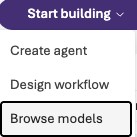

1. In the models search bar, enter *gpt-4.1* and click the **gpt-4.1** model search result:

    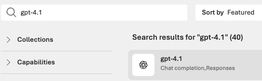

    A page summarizing the capabilities of the model will be displayed.

1. In the top-right corner, click **Deploy** > **Custom settings**:

    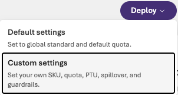

    The QA lab environment requires a custom configuration for the model deployment to succeed.

1. In the **Deploy gpt-4.1** blade, configure the following (leaving the others at their defaults):

    - **Tokens per minute rate limit**: Enter *5000*

    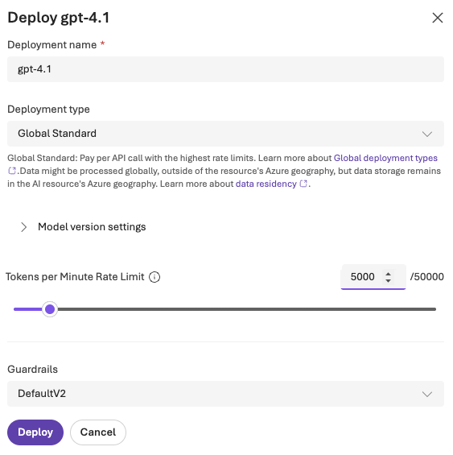

1. Click **Deploy**.

    After a brief delay, the playground for the model deployment is displayed.

1. In the upper-right corner, click **Save as agent**:

    

1. Enter *qa-agent* for the **Agent name**, then click **Create**:

    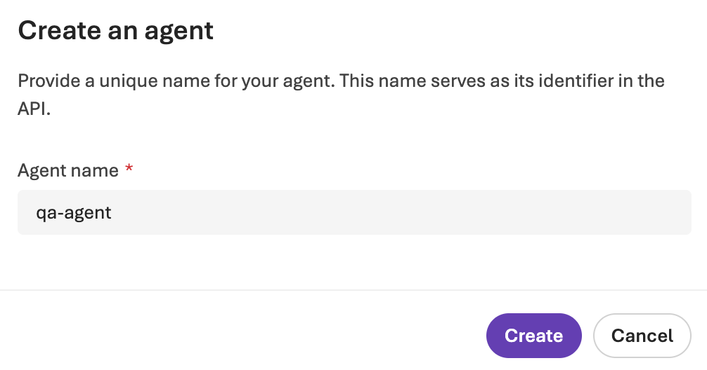{: style="width:503px"}

    Once completed, the Foundry portal will display the agent playground:

    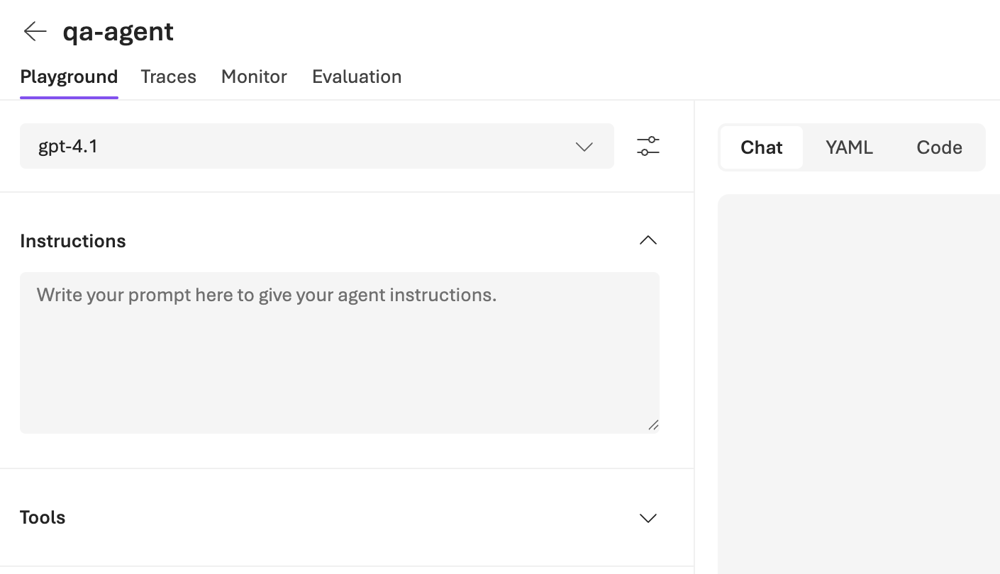{: style="width:705px"}

1. Enter the following instructions in the **Instructions** pane on the left:

    ```
    You are a helpful assistant.
    Respond clearly and concisely to user questions and requests.
    If you do not know the answer, say so.

    When answering a request:
    1. Think through the solution step by step.
    2. Explain your reasoning briefly.
    3. Then provide the final answer.
    ```

    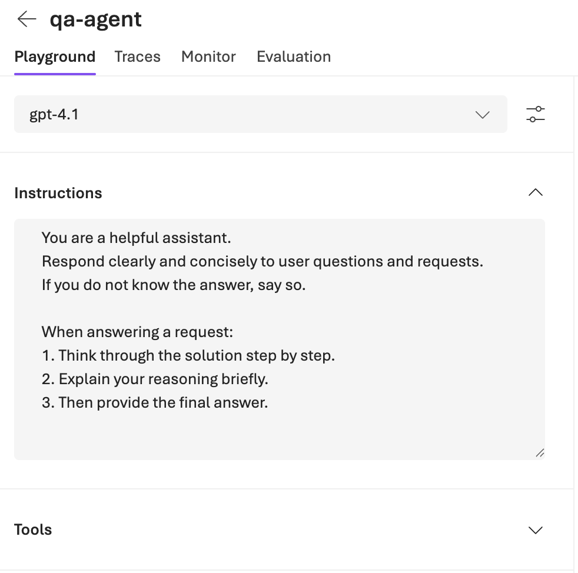{: style="width:491px"}

1. Click **Save** at the top of the page to save the agent instructions:

    {: style="width:65px"}

1. Message the agent by entering the following prompt in the input box at the bottom of the center pane, then clicking the **Send** button (paper airplane icon):

    ```
    Why would you use dashboards instead of raw logs when monitoring an application?
    ```

    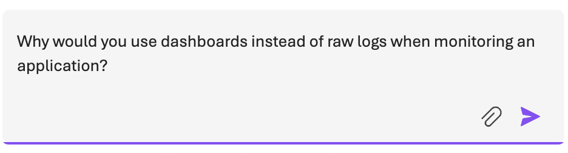{: style="width:468px"}

    The agent will respond with a similar answer to the following:

    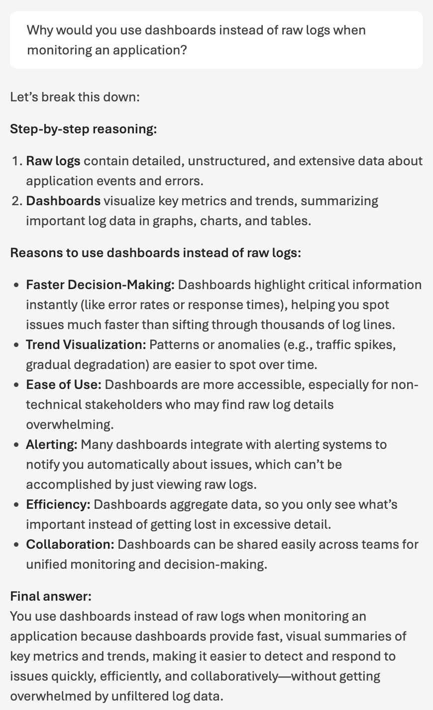{: style="width:435px"}

1. At the bottom of the agent response, the following information is displayed:

    - **Model**: The AI model used to generate the response (e.g., gpt-4.1)
    - **Response time**: The time taken to generate the response
    - **Tokens used**: The number of tokens consumed for the request and response
    - **Evaluation**: AI quality score for the response
    - **Debug**: Additional technical details about the response generation

    Hovering over the **Evaluation** score displays a tooltip explaining the score:

    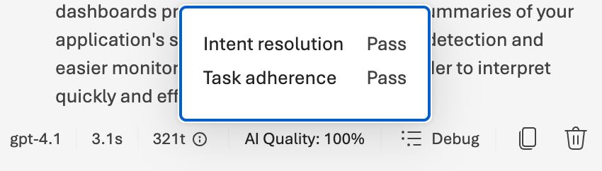{: style="width:425px"}

    The task adherence and intent resolution scores indicate how well the agent followed the instructions and addressed the user's intent. These metrics can be useful for assessing and improving agent performance.

1. To view more evaluation metrics for each response, click the **Metrics** dropdown menu at the top of the chat pane:

    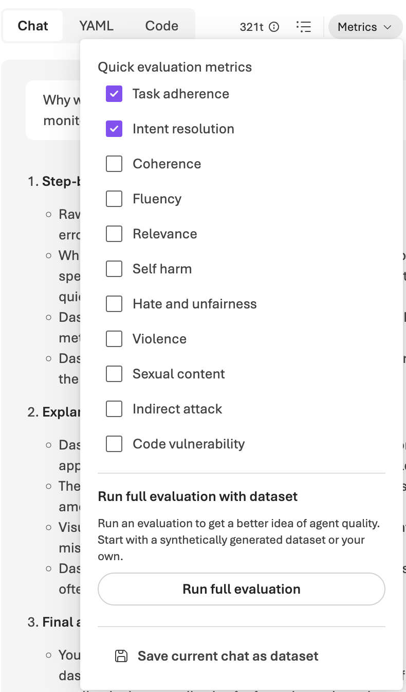{: style="width:395px"}

    Enable additional metrics such as **Coherence**, **Fluency**, and **Relevance** by toggling the switches next to each metric and asking the agent another question to see the updated metrics.

    *Note*: Each evaluation metric increases the number of tokens used which impacts model cost and may be rate-limited.

1. Ensure only the **Task adherence** and **Intent resolution** metrics are enabled before continuing to the next lab step.

### Summary

In this lab step, you created an AI agent using the Microsoft Foundry portal and reviewed its response to a user query. You defined the agent's instructions and explored the evaluation metrics provided for each response.
