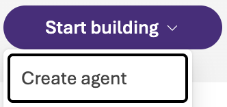

### Introduction

- Create an AI agent using Microsoft Foundry Agent Service.

### Instructions

1. Click the **Start building** dropdown menu and select **Create agent**:

    

1. Enter *qa-agent* for the **Agent name**, then click **Create**:

    

    Once completed, the Foundry portal will display the agent playground:

    

1. Enter the following instructions in the **Instructions** pane on the left:

    ```
    You are a helpful assistant.
    Respond clearly and concisely to user questions and requests.
    If you do not know the answer, say so.

    When answering a request:
    1. Think through the solution step by step.
    2. Explain your reasoning briefly.
    3. Then provide the final answer.
    ```

    

1. Click **Save** at the top of the page to save the agent instructions:

    

1. Message the agent by entering the following prompt in the input box at the bottom of the center pane, then clicking the **Send** button (paper airplane icon):

    ```
    Why would you use dashboards instead of raw logs when monitoring an application?
    ```

    

    The agent will respond with a similar answer to the following:

    

1. At the bottom of the agent response, the following information is displayed:

    - **Model**: The AI model used to generate the response (e.g., GPT-4o)
    - **Response time**: The time taken to generate the response
    - **Tokens used**: The number of tokens consumed for the request and response
    - **Evaluation**: AI quality score for the response
    - **Debug**: Additional technical details about the response generation

    Hovering over the **Evaluation** score displays a tooltip explaining the score:

    

    The task adherance and intent resolution scores indicate how well the agent followed the instructions and addressed the user's intent. These metrics can be useful for assessing and improving agent performance.

1. To view more evaluation metrics for each response, click the **Metrics** dropdown menu at the top of the chat pane:

    

    Feel free to enable additional metrics such as **Coherence**, **Fluency**, and **Relevance** by toggling the switches next to each metric and asking the agent another question to see the updated metrics.

### Summary

In this lab step, ...
