### Introduction

In this lab step, you will connect Application Insights to the Foundry project and use the pre-deployed model in the Microsoft Foundry portal to create a simple AI agent. You will define the agent's instructions and interact with it to see how it responds to user queries.

### Instructions

1. Click the project name in the top-left corner, then select **Project details** from the drop-down menu:

    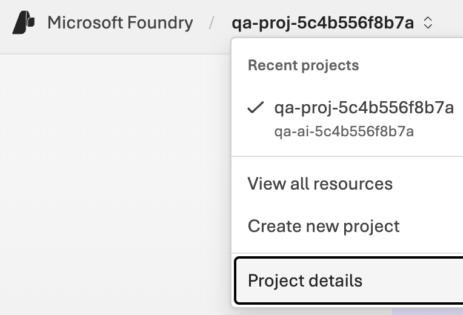{: style="width:382px"}

1. On the project admin page, select **Connected resources** tab, then click **Add connection** button:

    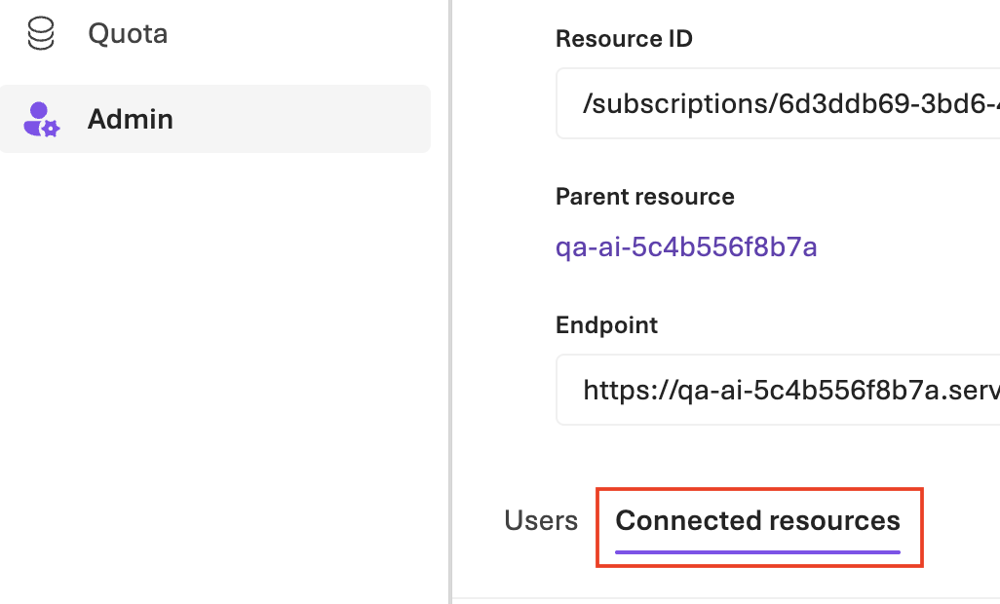{: style="width:449px"}

    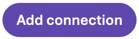{: style="width:141px"}

    A pop-up with the available resources to connect will be displayed.

    *Note*: If the **Add Connection** button is grayed out, refresh the page.

1. Select **Application Insights** and click **Continue**:

    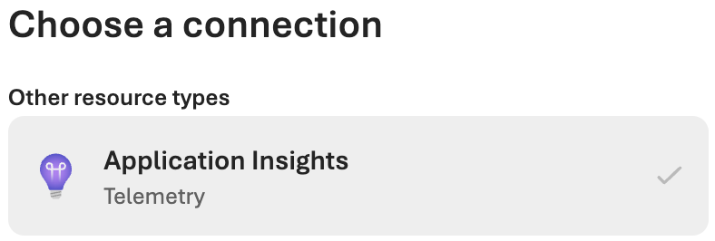{: style="width:394px"}

    In the **Create a new connection** window, select the pre-deployed Application Insights resource and click **Connect**:

    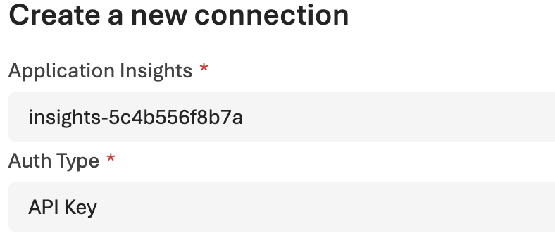{: style="width:394px"}

    Once connected, Foundry will begin sending agent traces to Application Insights. The connection will be listed under **Connected resources** tab:

    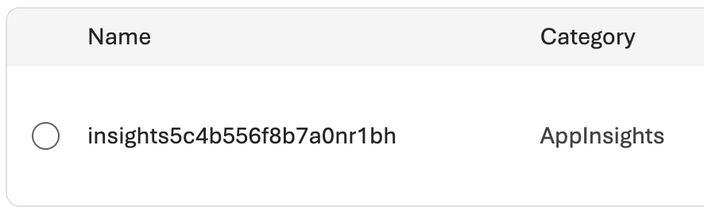{: style="width:443px"}

1. Click **Discover** in the top-right menu, then select **Models** from the left-hand menu:

    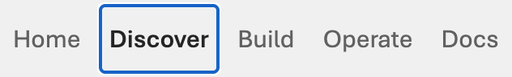{: style="width:316px"}

    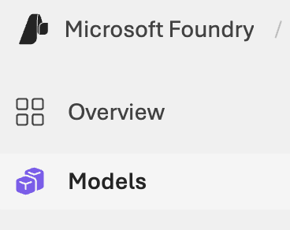{: style="width:184px"}

1. In the search bar, type *gpt-5-mini*, then select the **gpt-5-mini** model from the results:

    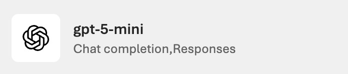{: style="width:347px"}

    The **gpt-5-mini** model overview page is displayed:

    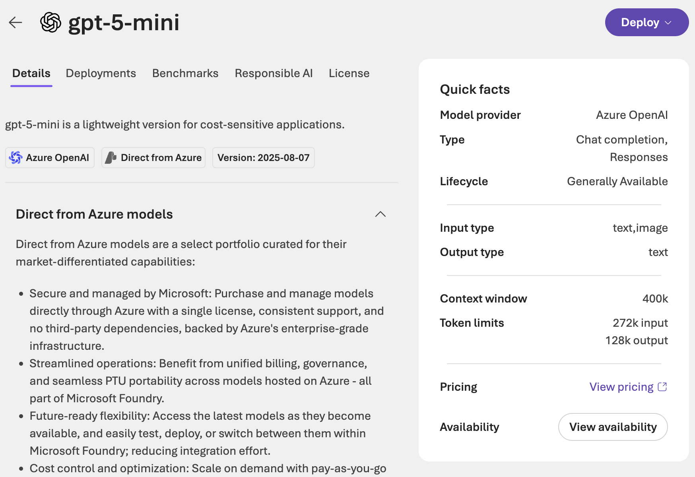{: style="width:620px"}

    Clicking the **Deploy** button gives you options to preconfigure the model with custom settings before deployment. 
    
    For this lab, the model has already been provisioned. Click **Deploy** > **chat-model**:

    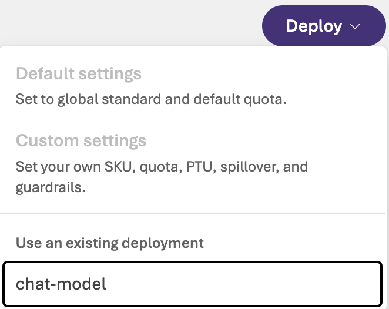{: style="width:331px"}

    The model playground will load.

1. Click on **Save as agent** button and enter *qa-agent-##* for the **Agent name**, replacing *##* with a unique string if neccessary, then click **Create and open playground**:

    {: style="width:126px"}

    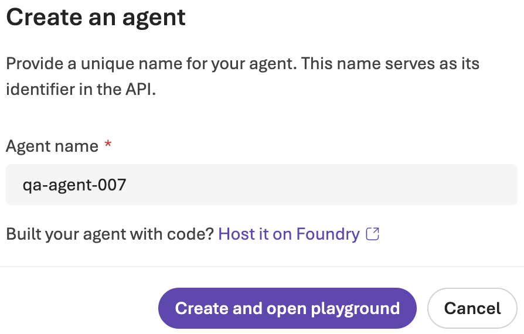{: style="width:447px"}

    Once completed, the Foundry portal will display the agent playground:

    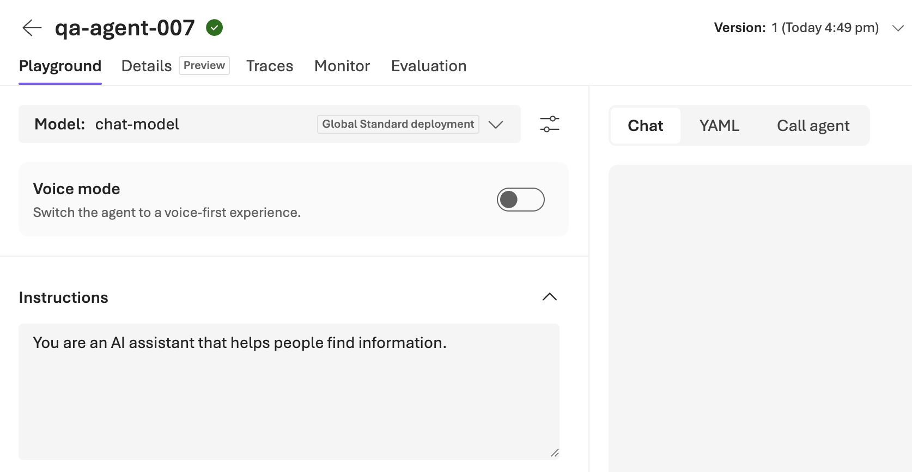{: style="width:620px"}

1. Enter the following instructions in the **Instructions** pane on the left:

    ```
    You are a helpful assistant.
    Respond clearly and concisely to user questions and requests.
    If you do not know the answer, say so.

    When answering a request:
    1. Think through the solution step by step.
    2. Explain your reasoning briefly.
    3. Then provide the final answer.
    ```

    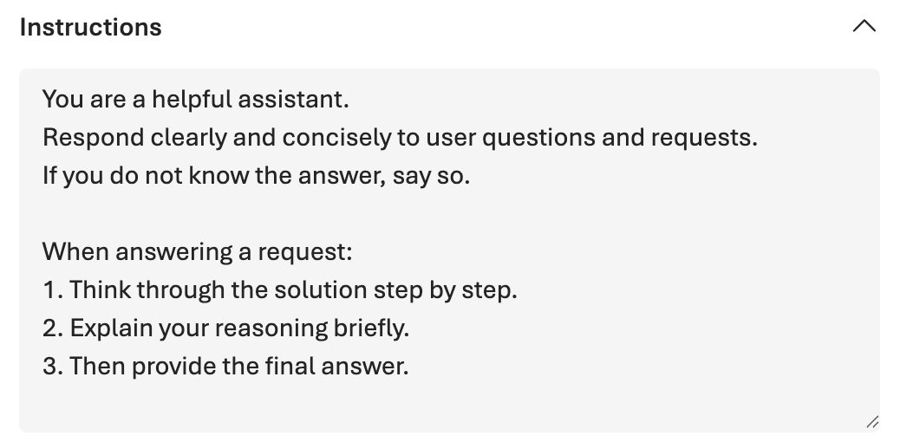{: style="width:449px"}

1. Click **Save** at the top of the page to save the agent instructions:

    {: style="width:70px"}

1. Message the agent by entering the following prompt in the input box at the bottom of the center pane, then clicking the **Send** button (paper airplane icon):

    ```
    Why would you use dashboards instead of raw logs when monitoring an application?
    ```

    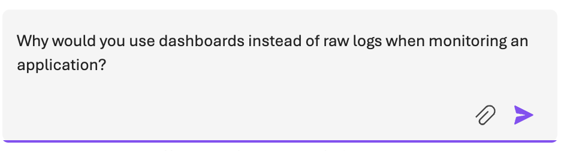{: style="width:449px"}

    The agent will respond with a similar answer to the following:

    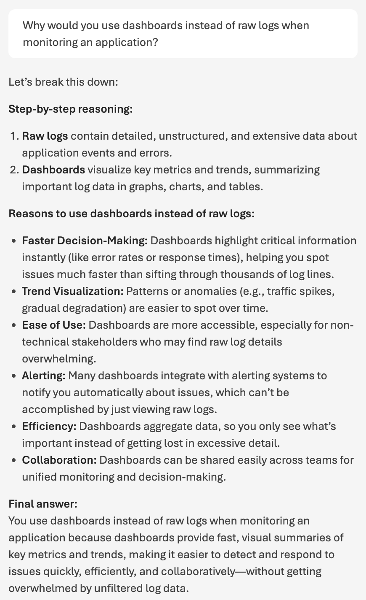{: style="width:435px"}

1. At the bottom of the agent response, the following information is displayed:

    - **Model deployment**: The deployed model name used to generate the response
    - **Response time**: The time taken to generate the response, such as **6.5s**
    - **Tokens used**: The number of tokens consumed for the request and response
    - **Message**: Indicates that the item shown is a chat message response
    - **Traces**: Opens the trace details for the request, where you can inspect the execution flow and related telemetry

    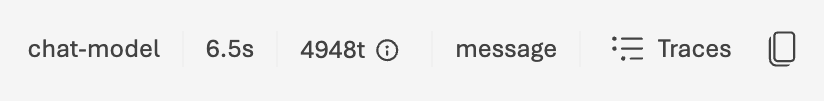{: style="width:412px"}

1. To view evaluation metrics for each response, click the **Metrics** dropdown menu at the top of the chat pane:

    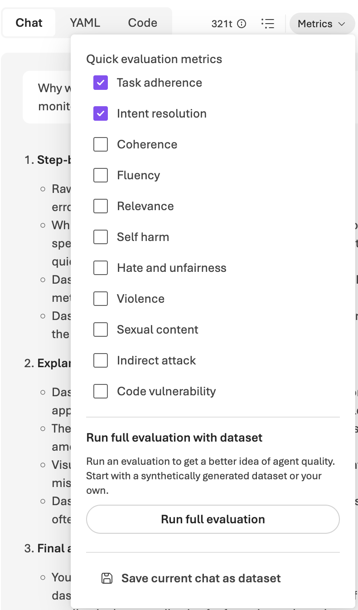{: style="width:395px"}

    The **Task adherence** and **Intent resolution** scores indicate how well the agent followed the instructions and addressed the user's intent. These metrics can be useful for assessing and improving agent performance.

    Enable additional metrics such as **Coherence**, **Fluency**, and **Relevance** by toggling the switches next to each metric and asking the agent another question to see the updated metrics.

    *Note*: Each evaluation metric increases the number of tokens used which impacts model cost and may be rate-limited.

1. Ensure that only the **Task adherence** and **Intent resolution** metrics are enabled, then run another prompt:

    ```
    Plan a 2-day itinerary for a first-time visitor to Seattle with a budget of $200/day.
    ```

    *Note*: If you encounter a rate limit error, wait a minute and try again.

### Summary

In this lab step, you created an AI agent using the Microsoft Foundry portal and reviewed its response to a user query.


