### Introduction

In this lab step, you will configure observability features for your AI agent using Application Insights and Log Analytics. You will set up monitoring and alerting to track the performance and health of your AI agent, ensuring that you can effectively evaluate its behavior and make necessary adjustments.

### Instructions

1. Click the **Traces** tab in the **qa-agent** view:

    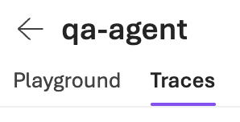{: style="width:149px"}

    Foundry traces make AI agent behavior visible by showing each step, tool call, and decision an agent takes during execution. This visibility helps teams quickly debug failures, understand why an agent behaved a certain way, and pinpoint performance bottlenecks. By tying outcomes to internal steps, traces turn opaque agent workflows into actionable insights.

    Foundry emits agent traces using OpenTelemetry and sends them to a connected Azure Application Insights resource. Application Insights then stores, queries, visualizes, and correlates these traces with logs, metrics, and errors for end-to-end observability.

    *Note*: You may see a 404 message above the traces which should go away over time and can be ignored for this lab.

1. Click **Connect** at the top of the page to connect an Application Insights resource to enable tracing:

    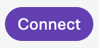{: style="width:70px"}

1. Select the **insights-###** Application Insights resource from the dropdown menu, then click **Connect**:

    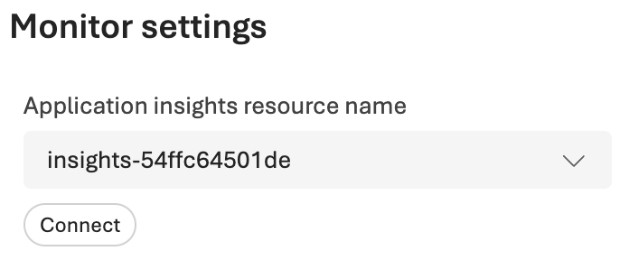{: style="width:348px"}

    Once connected, Foundry will begin sending agent traces to Application Insights.

1. Click the **Playground** tab to return to the agent playground, and ask the agent the following question in the chat input:

    ```
    Plan a 2-day itinerary for a first-time visitor to Seattle with a budget of $200/day.
    ```

    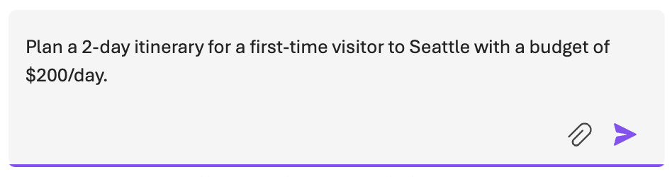{: style="width:474px"}

    A few moments after the response is generated, Foundry will emit traces for the agent execution to Application Insights.

1. Return to the **Traces** tab, and you should see a new trace for the recent agent execution:

    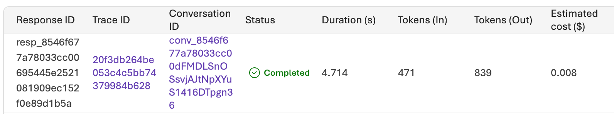{: style="width:796px"}

    *Note*: It may take a minute or two for the trace ID to appear but it will eventually show up.

1. Click the **Trace ID** of the latest trace entry to view detailed information about the agent's response:

    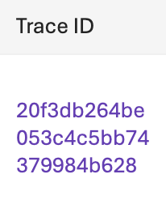{: style="width:103px"}

    A trace view displays a timeline of all the steps the agent took to generate its response, including tool calls, reasoning steps, and final answers. This detailed trace helps you understand the agent's decision-making process and identify any potential issues.

    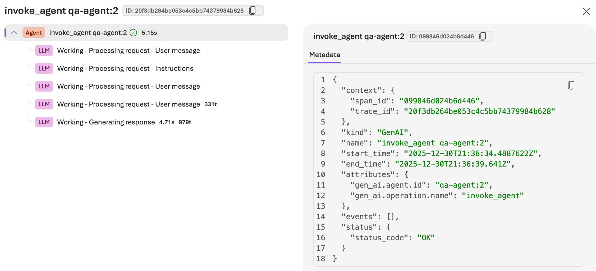{: style="width:1127px"}

    In the example above, the agent is only using its internal reasoning capabilities (LLM) without calling any external tools. In more complex scenarios, you may see additional spans representing calls to external APIs or services.

    Stepping through the trace spans provides insights into how the agent arrived at its final answer, allowing you to debug and optimize its behavior effectively.

1. Exit out of the trace entry and click the **Monitor** tab at the top of the page:

    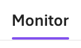{: style="width:68px"}

    The Monitor tab provides an overview of key performance metrics for your AI agent, including Agent runs, Runs and token metrics, tool calls, and error rates. This information helps you track the health and performance of your agent over time.

    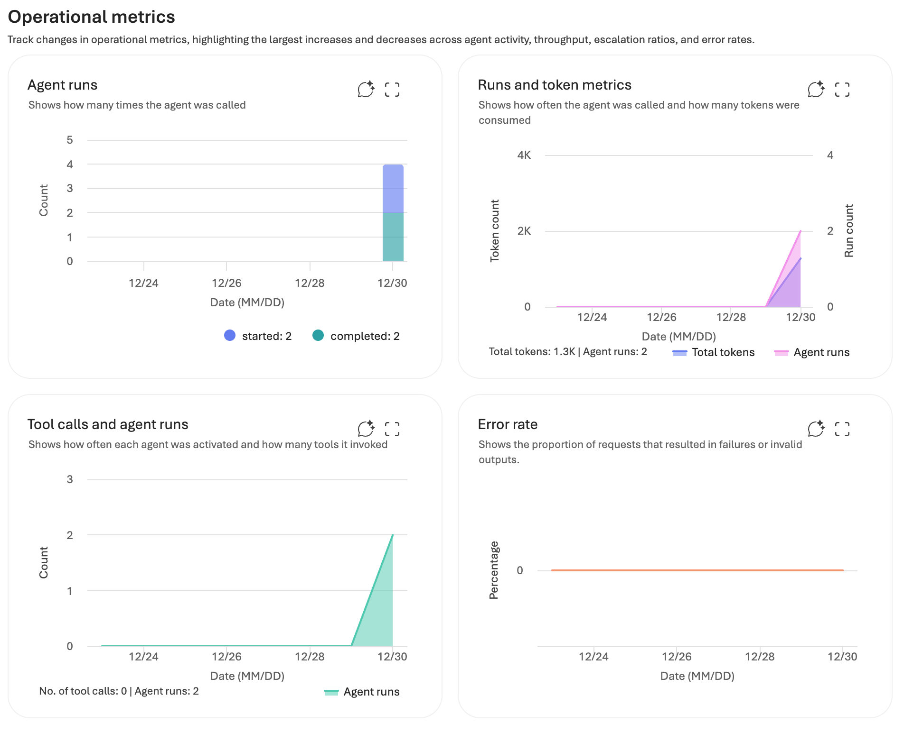{: style="width:952px"}

    In addition to monitoring, Foundry also provides automated agent evaluations.

1. Click **Settings** above the metrics dashboard:

    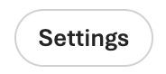{: style="width:92px"}

    With an Application Insights resource connected, you can enable automated evaluations for your AI agent. These evaluations use AI models to assess the quality of agent responses based on criteria such as relevance, coherence, and fluency.

    - **Continuous evaluations**: Automatically evaluates agent responses in near-real time as the agent is used, scoring outputs for quality, safety, or correctness. This provides an always-on signal of agent health and helps catch regressions or drift early.
    - **Scheduled evaluations**: Runs predefined evaluation suites on a fixed schedule (for example, daily or weekly) using consistent prompts and datasets. This lets you track performance trends over time and compare agent behavior across versions.
    - **Scheduled red teaming runs**: Executes adversarial or stress-test scenarios on a schedule to probe safety, robustness, and policy compliance. These runs help uncover edge cases, misuse risks, and failure modes before they appear in real usage.
    - **Evaluation alerts**: Trigger notifications when evaluation scores cross defined thresholds or degrade unexpectedly. Alerts turn evaluation results into actionable signals so teams can respond quickly to quality, safety, or reliability issues.

1. Enable the **Continuous evaluations** toggle, configure the following settings, then click **Submit**:

    - **Evaluators**: Click **Add evaluators**, then select **Coherence-Evaluator** and **Fluency-Evaluator**
    - **Sample rate** Set to **2** runs per hour

    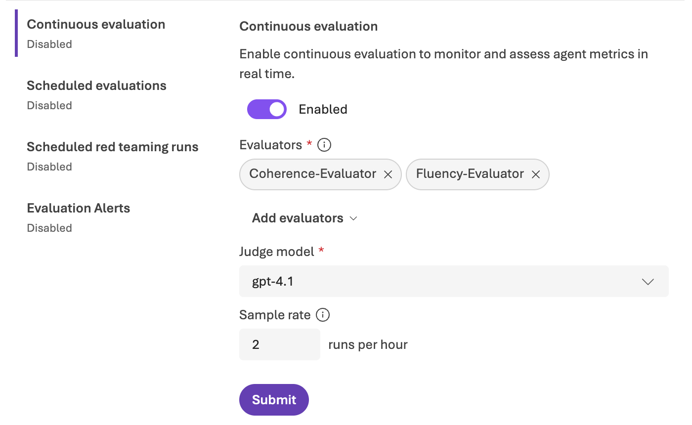{: style="width:700px"}

    Once enabled, Foundry will begin automatically evaluating agent responses using the selected evaluators. You can view evaluation results in the agent playground and set up alerts based on evaluation scores.

    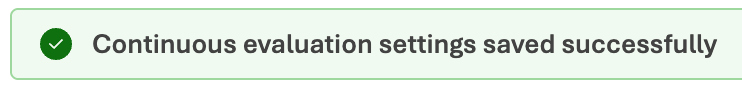{: style="width:371px"}

    *Note*: The Azure AI User role is automatically assigned to the Foundry project managed identity when running the previous lab step's validation check. This is a requirement for continuous evaluations. It may take a few minutes for the role assignment to propagate before enabling evaluations. If you see a warning, you can safely ignore it and proceed.

1. Click **Evaluation Alerts**, and set the toggle slider to enabled:

    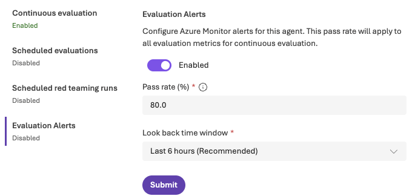

    The default threshold and look back window will suffice for this lab but can be configured based on your specific tolerances in practice.

1. Click **Submit** to save the alert settings.

    You will briefly look at log analytics search rule that is created as a result of enabling evaluation alerts to see how the alerts tie into Log Analytics.

1. Return to your Azure portal browser tab opened to the lab's resource group, and refresh the resources list:

    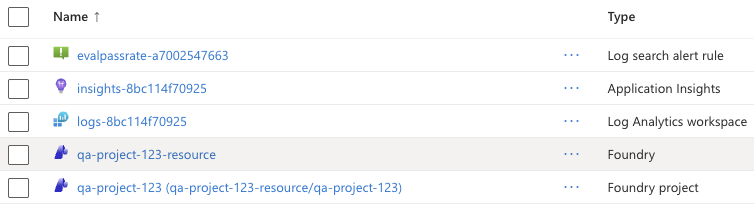

    The log search rule beginning with **evalpassrate** was created when you enabled evaluation alerts in Foundry.

1. Click the log search rule to view its details, and expand the **Query** at the bottom:

    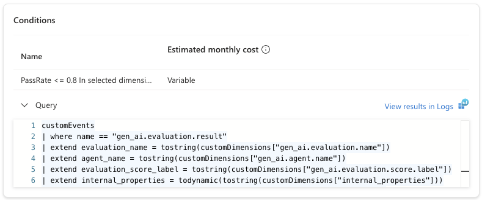

    This shows the Kusto Query Language (KQL) query that runs on the connected Log Analytics workspace to evaluate agent performance and trigger alerts when evaluation scores fall below the defined threshold. Fully understanding the query is out of scope for this lab, but you can see Foundry agents transmit custom events (the `customEvents` table is queried) with the name `gen_ai.evaluation.result` containing evaluation results.

1. Click **View results in Logs** just above the query to open the Log Analytics workspace.

    There won't be any evaluation results yet since you just enabled continuous evaluations, but you can inspect the events that are transmitted.

1. Click the table icon on the left to view available tables, then click **Run** next to **customEvents**:

    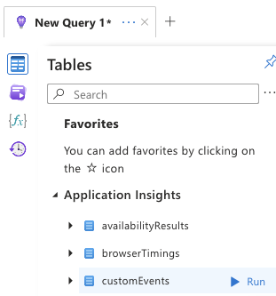

1. Expand one of the rows and all of its nested properties (**customDimensions** and **internal_properties**) in the results to inspect the full event:

    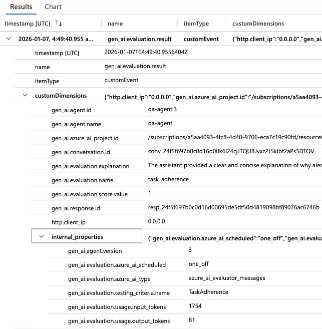

    The **gen_ai.evaluation.score.value** and **gen_ai.evaluation.testing_criteria.name** properties are of particular interest, as they contain the evaluation score and the name of the evaluation criteria (e.g., Coherence, Fluency) for each evaluation result transmitted by Foundry.

### Summary

In this lab step, you configured observability features for your AI agent using Application Insights and Log Analytics. You explored how Foundry emits traces to Application Insights, allowing you to visualize and debug agent behavior. You also enabled automated evaluations to continuously assess the quality of agent responses. Finally, you set up evaluation alerts to notify you when agent performance degrades, enabling proactive monitoring.

By completing this lab, you have successfully:

- Created a Microsoft Foundry project and AI agent
- Configured observability features using Application Insights and Log Analytics
- Covered monitoring and alerting for an AI agent
